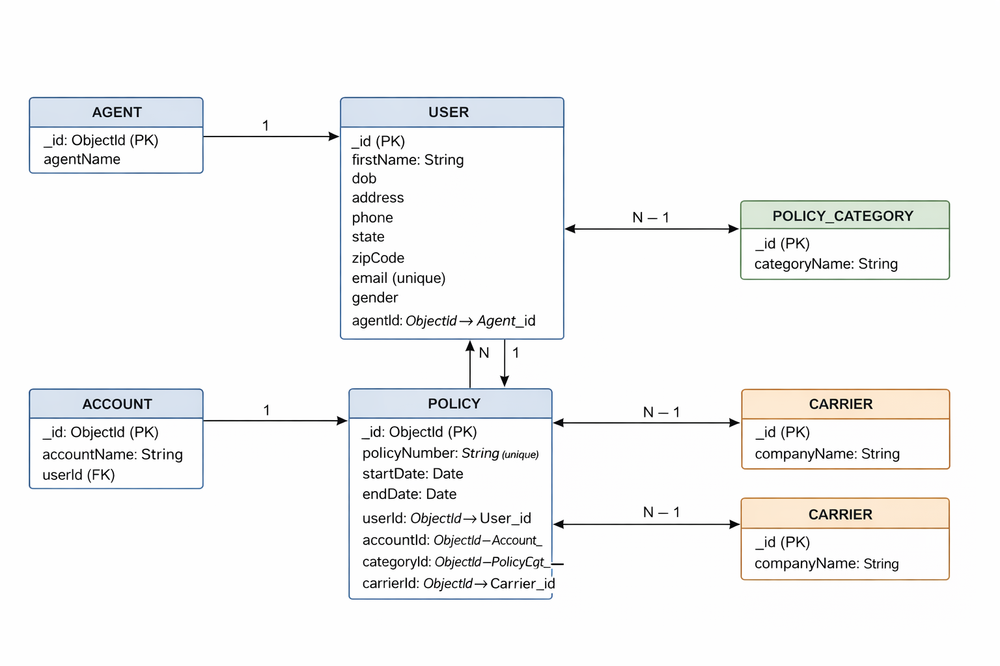

# InsuredMine – Node.js Technical Assessment

## Overview

This project is developed as part of the **InsuredMine Node.js Technical Assessment**. It demonstrates backend skills including:

* CSV/XLSX file upload
* Worker Threads for background processing
* MongoDB data modeling & relationships
* REST APIs using Express.js
* Aggregation & search APIs
* CPU usage monitoring and auto-restart logic
* Scheduled task execution (delayed DB insert)

The application is built using **Node.js, Express.js, MongoDB (Mongoose)** following a clean **MVC architecture**.

---

## Tech Stack

* **Node.js (v20+)**
* **Express.js**
* **MongoDB**
* **Mongoose**
* **Worker Threads**
* **Multer** (file upload)
* **csv-parser**
* **dotenv**

---

## Project Structure

```
src/
 ├── config/
 │    └── db.js
 ├── controllers/
 ├── models/
 ├── routes/
 ├── services/
 ├── workers/
 ├── app.js
 └── server.js
```

---

## Database Collections

The following collections are used:

* **Agent** – Agent details
* **User** – User personal information
* **Account** – User account details
* **Category (LOB)** – Policy category
* **Carrier** – Insurance carrier
* **Policy** – Policy information
* **ScheduledMessage** – Scheduled tasks/messages
* **Message** – Executed messages

Each entity is stored as a **separate collection** as required.

---

## Task 1 – CSV Upload & Policy APIs

### 1️⃣ Upload CSV/XLSX using Worker Threads

**Endpoint**

```
POST /api/upload
```

**Description**

* Uploads CSV/XLSX file
* Uses Worker Threads to process data asynchronously
* Inserts data into MongoDB collections
* Prevents blocking the main thread

---

### 2️⃣ Search Policy by Username

**Endpoint**

```
GET /api/policies/search?username=<firstName>
```

**Description**

* Finds user by first name
* Fetches all policies linked to that user
* Uses Mongoose population for relations

---

### 3️⃣ Aggregate Policies by User

**Endpoint**

```
GET /api/policies/aggregate
```

**Description**

* Groups policies by user
* Returns total policy count per user
* Implemented without MongoDB aggregation pipeline

---

## Task 2 – Server Monitoring & Scheduling

### 1️⃣ CPU Usage Monitoring

**Description**

* Tracks real-time CPU utilization using Node.js `os` module
* Checks CPU usage every 5 seconds
* If usage exceeds **70%**, server exits automatically
* Process manager (nodemon / PM2) restarts the server

This ensures server stability under high load.

---

### 2️⃣ Scheduled Message Insert Service

**Endpoint**

```
POST /api/messages/schedule
```

**Request Body**

```json
{
  "message": "Policy renewal reminder",
  "day": "2026-01-08",
  "time": "04:30"
}
```

**Working**

1. API stores message and scheduled timestamp in `ScheduledMessage` collection
2. Timestamp is stored in **UTC** format
3. Background scheduler runs every minute
4. When current time >= scheduled time:

   * Message is inserted into `Message` collection
   * Scheduled record is marked as executed

This ensures **delayed execution** without blocking the server.

---

## Timezone Handling

* All timestamps are stored in **UTC**
* Local time (IST) is automatically converted by JavaScript Date
* Ensures consistency across environments

---

## How to Run the Project

### 1️⃣ Install dependencies

```bash
npm install
```

### 2️⃣ Setup Environment Variables

Create a `.env` file in root directory:

```env
PORT=5000
MONGO_URI=mongodb://127.0.0.1:27017/insuredmine
```

### 3️⃣ Start Server

```bash
npm run dev
```

---

## Key Highlights

* Non-blocking CSV processing using Worker Threads
* Clean separation of concerns (MVC)
* Restart-safe scheduling logic
* Production-friendly error handling
* Timezone-safe scheduled execution

---


## Notes

* Scheduler requires server to be running
* CSV format must match provided sample sheet
* MongoDB must be running locally or remotely

---


## ER Diagram

The following diagram represents the database schema and relationships between
Agent, User, Account, Policy, Category (LOB), and Carrier collections.



